# Отчет 4 (Александр Сластин, ИТМО)

# Вступление

Аналогично [предыдущему отчету](../stage3/report.md) за исключением  `OK_LATENCY_LOWER_BOUND`=`0.5ms`, `OK_LATENCY_UPPER_BOUND`=`2.5ms`.

# Сценарий

Аналогичен предыдущему отчету

# Структура отчета и детали реализации

- Начну с замера изменения скорости запросов при изменении `ack` / `from`
- PUT/GET запросы будут запускаться на полной БД (`8.2 Gb`), заполненной с помощью [Fill.java](../../Fill.java)
- Точку разладки буду искать с помощью самописного [profiler.py](../../profile/profiler.py). Для PUT запросов будет использоваться [put.lua](../../profile/lua/hw4/put.lua), а для GET запросов будет использоваться [get.lua](../../profile/lua/hw4/get.lua)

Далее зафиксирую определенные `ack` / `from` и сравню, как изменилась работа сервера по сравнению с прошлым домашним заданием:
1. CPU (общий взгляд, причина разладки)
2. ALLOC (общий взгляд, сравнение с соседом)
3. LOCK (общий взгляд)

Наконец, общий вывод.

# Анализ

## Выбор ack / from

Каждый раз буду запускать профайлер следующим образом, меняя параметры `ack` / `from`:
- для PUT: `python3 profiler.py -t 8 -c 64 -d 1m -s lua/hw4/put.lua -u http://localhost:2022 -sn Launch`
- для GET: `python3 profiler.py -t 8 -c 64 -d 1m -s lua/hw4/get.lua -u http://localhost:2022 -sn Launch`

### ack=1, from=1

GET: 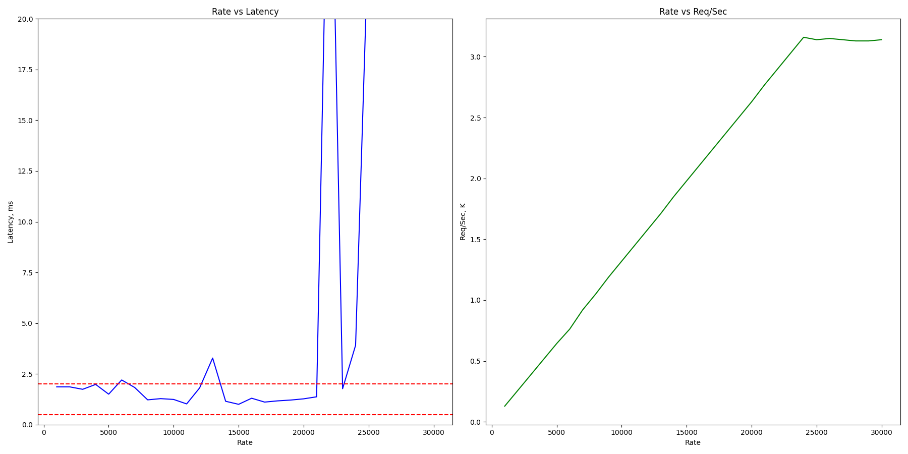
PUT: 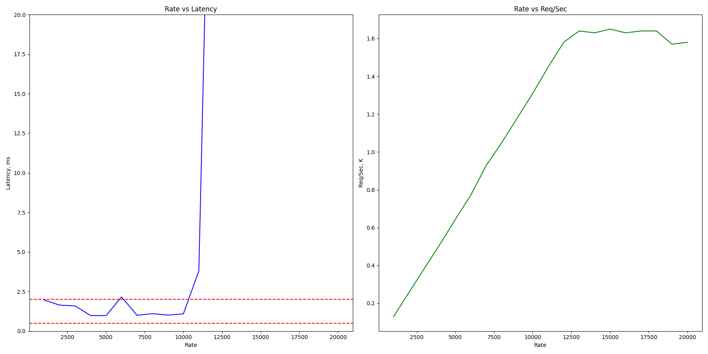

Точка разладки для GET и PUT запросах уменьшилась на 1000. Это объяснимо тем, что теперь с каждым запросом передается timestamp для доп парсинга.

### ack=1, from=2

GET: 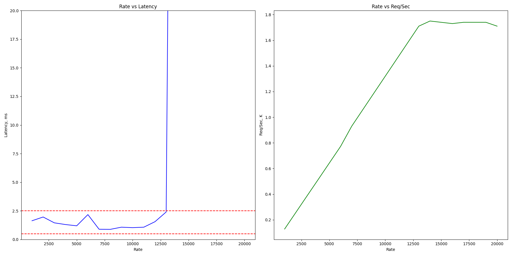
PUT: 

По сравнению с предыдущими параметрами скорость запросов уменьшилась вдвое. Это естественно, ведь теперь вместо одного запроса шлем оба.

### ack=2, from=2

GET: 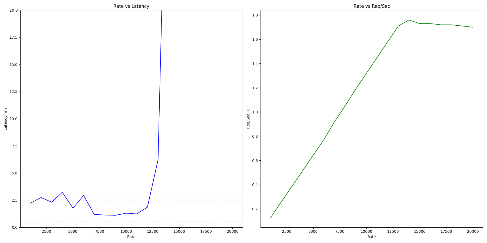
PUT: 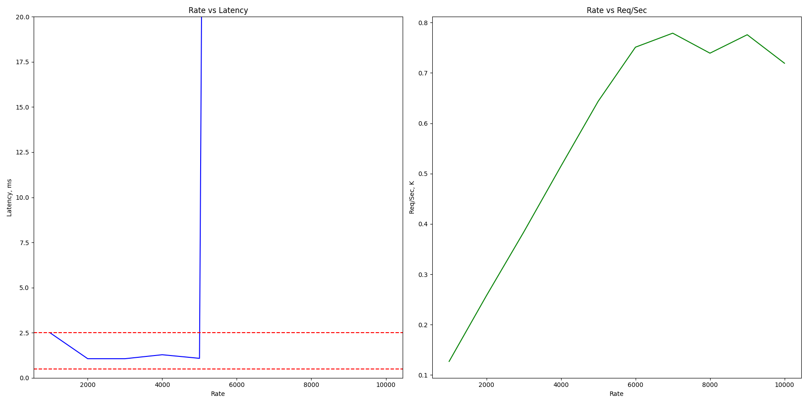

По сравнению с предыдущими параметрами слегка уменьшилась только скорость запросов для GET. Это связано с тем, что теперь в GET появляется логика мерджинга результатов, а на это нужны доп ресурсы.

### ack=1, from=3

GET: 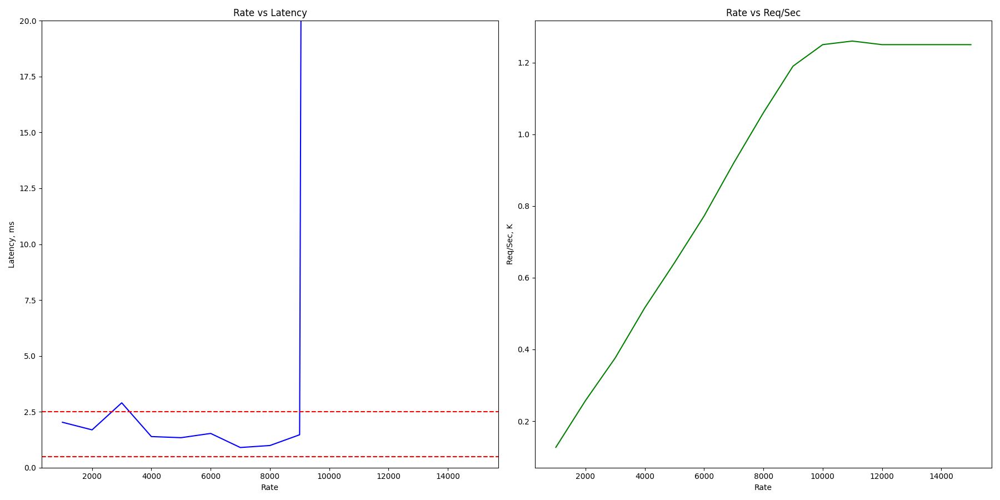
PUT: 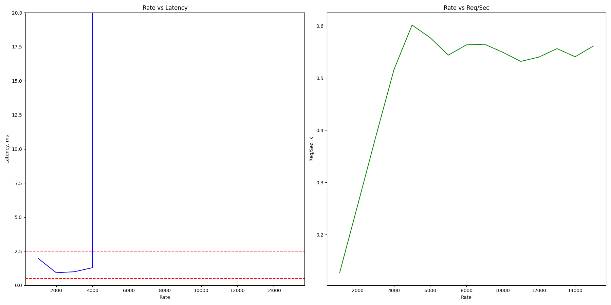

Скорость запросов и для GET, и для PUT также уменьшилась по сравнению с предыдущими параметрами. Это естественно, ведь теперь вместо 2-х внутренних запросов на каждый клиентский запрос шлется 3 внутренних.

### ack=2, from=3

GET: 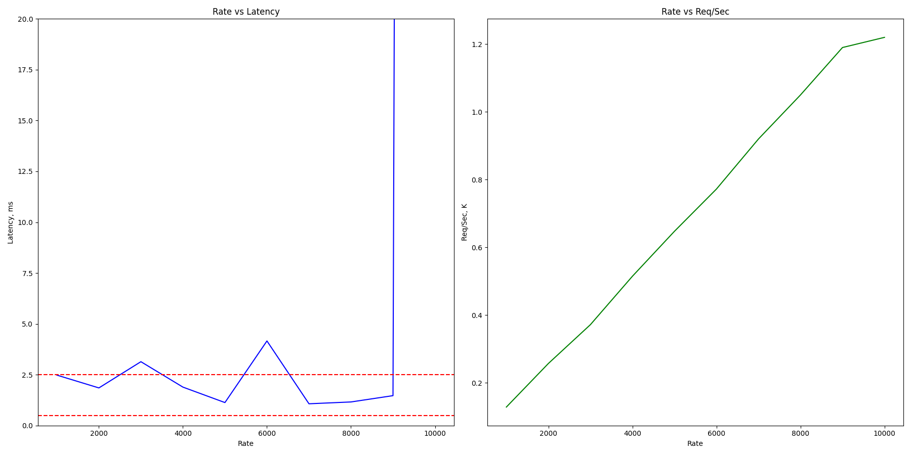
PUT: 

Скорость осталось той же, что и в предыдущий раз. Показывает, что общение по сети происходит быстро, а также мерджинг запросов не сильно увеличился при добавлении +1 ответа.

### ack=3, from=3

GET: 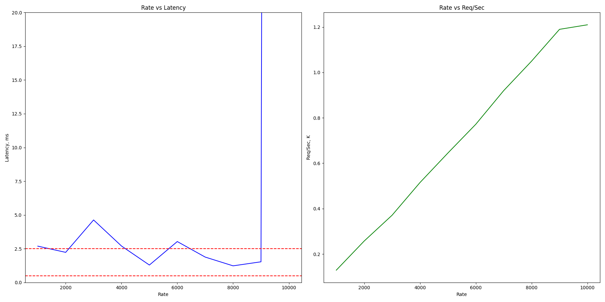
PUT: 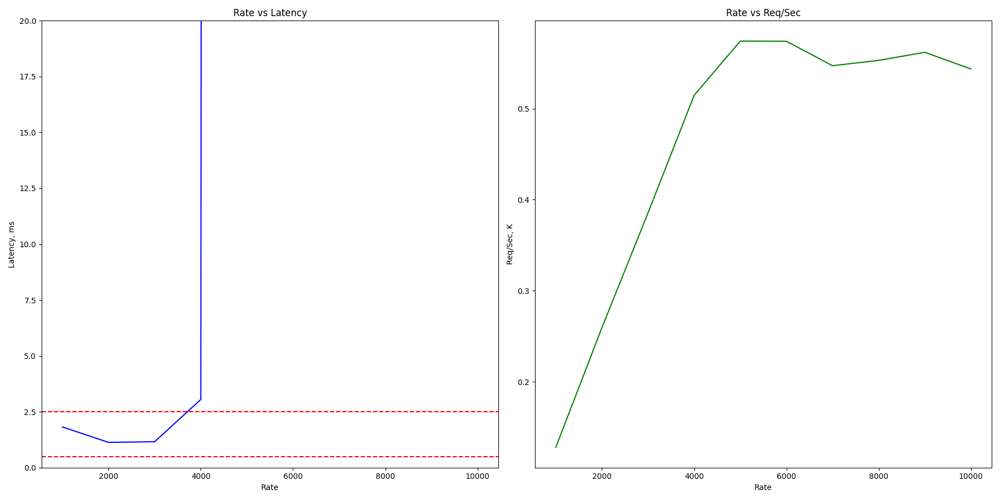

Ситуация такая же, как и при прошлых параметрах. Была бы иной, если бы часто ноды умерали, но так как запуски происходят локально - это ожидаемый результат.

### Вывод

Как видно из графиков - репликация не бесплатная, и потребляет не мало ресурсов и кол-во потребляемых ресурсов растет с увеличением кол-ва реплик (`from`), запрос которым мы посылыем.

При локальном запуске параметр `ack` не сильно влияет на производительность, так как ноды не падают, но в реальном мире стоит ожидать иных цифр.

Из графиков не следует, но система с репликацией надежнее, и позволяет пережить проблемы с нодами.

Также стало понятно, почему в реальности не реализуют протоколы PAXOS / Raft повсеместно: уже при игрушечной нашей репликации, где возможны неконсистентности, производитлеьность сильно падает. Если же добавлять более строгий протокол сихнронизации, то производительноть станет еще хуже. Нужно понимать, в каких системах без этого не обойтись, а где все же можно что-то ослабить.

Далее проанализируем изменения cpu/alloc/lock при `ack=2`, `from=2` в точке разладки (GET: `12000 rate`, PUT: `5000 rate`), и увидим, в каких местах начинает хромать перфоманс.

## GET

### CPU

#### Общий взгляд

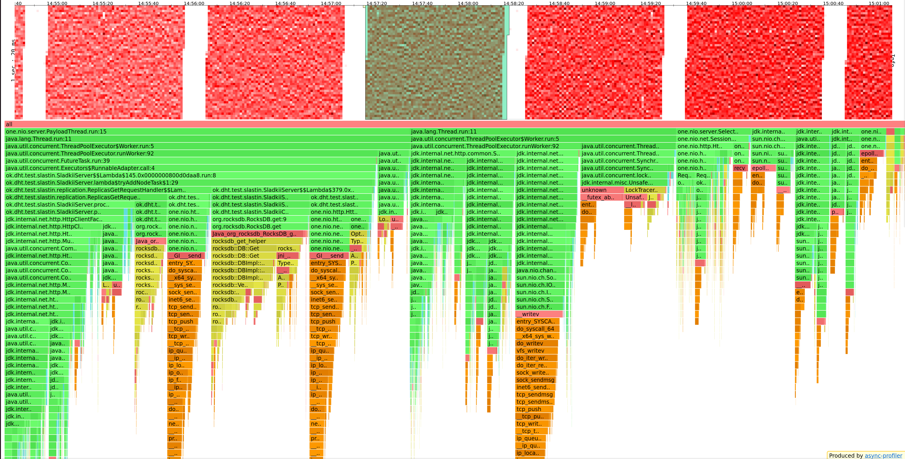

Профиль остался тем же, за исключением того, что кол-во запросов в БД увеличилось (желтых столбцов 2, маленький - запрос в локальной БД, большой - внутренний запрос к другой ноде): это связано с тем, что на каждый запрос к реплике идет поход в ее БД.

`merge` в профиле не наблюдается, что означает, что на активное ожидание тратится мало cpu, и это только хорошо.

#### Причина разладки

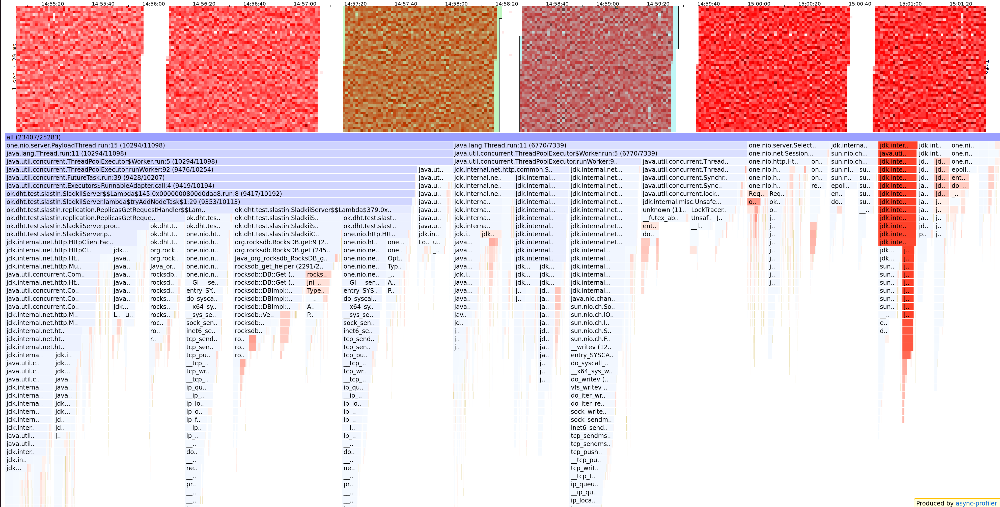

Профиль при увелчении скорости запросов не изменился, и причины те же, что и в предыдущем д/з: у сервера просто не хватает ресурсов на быстрое общение по сети, и быстрые походы в БД.

### ALLOC

#### Общий взгляд

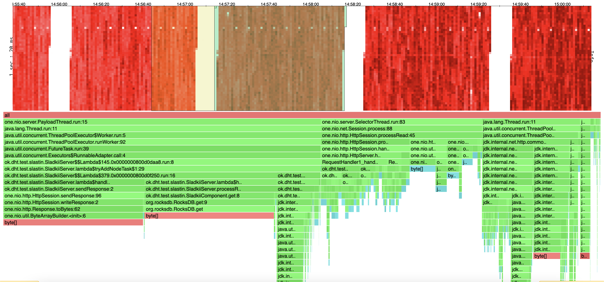

Кол-во аллокаций стало больше, так как на каждый GET-запрос надо  сформировать не один запроса, а два, но профиль остался тем же.

#### Сравнение с соседом

Профиль остался тем же, ожидаемым образом увеличилось просто число аллокаций.

### LOCK

#### Общий взгляд

По локам профиль аналогичен профилю из предыдущего задания. Также нигде нет `merge` / счетчиков из `ReplicasRequestHandler`, что показывает, что при текущей нагрузке на них нет contention.

## PUT

### CPU

#### Общий взгляд

Профиль такой же как и в прошлом д/з за исключением того, что `RocksDb.put` разделился на 2 столбца: один (маленький) делается на сервере, куда пришел клиентский запрос, а другой (большой) на сервере, получившем внутренний запрос.

Также теперь дополнительно время тратится на работу с `ByteBuffer`, но оно не значительно (`2%`):

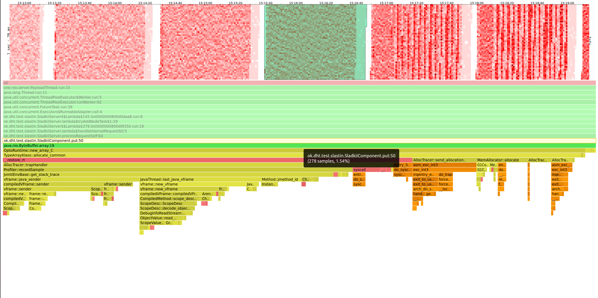

#### Причина разладки

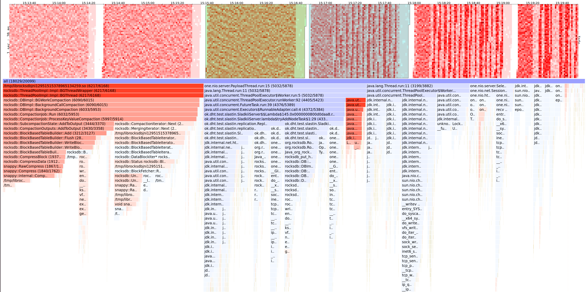

Как видно, по красному столбцу - compaction перестает успевать справляться с скоростью подачи запросов. Причины такие же как и в прошлом д/з: не хвататает ресурсов и для работы с БД, и для походов в сеть, и для выполнения `flush` / `compaction`. А далее уже встает вопрос трейдоффа: где можно уменьшить пулл, где увеличить, где отчего-то отказаться (например, от кодирования значения).

### ALLOC

#### Общий взгляд

Кол-во аллокаций стало больше: на `7%` больше в `SelectorThread`, и на `7%` больше в `PayloadThread`. Это здесь естественно и связано с тем, что теперь каждый PUT запрос принимается 2 сторонами, а значит каждая из них создает его копию.

Также теперь аллокации тратятся на создания `ByteBuffer`, так как перед сохранением в БД мы не просто делаем копию данных, а перед этим дополнительно оборачиваем их в ByteBuffer. Кажется это сложно убрать, учитывая, что теперь вместе с основными данными надо хранить еще и метаинформацию.

#### Сравнение с соседом

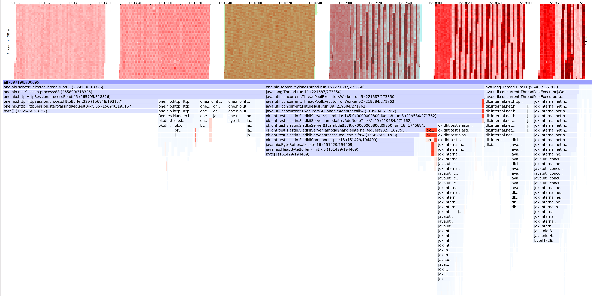

Увеличилось кол-во запросов -> в профиле равномерно увеличилось кол-во аллокаций.

### LOCK

#### Общий взгляд

Больше запросов происходит по сети (потому что с при каждоым PUT запросе совершается от 1 до 2 запросов по сети), поэтому по сравнению с предыдущим д/з столбец пула потоков для работы с сетью больше. В остальных местах также.

## Общий вывод

- Репликация не бесплатная, но дает больший durability
- Остались те же проблемы, что и из предыдущего д/з: воркер ждет __синхронно__ результат по сети от другой ноды, и его время тратится в никуда. Чтобы улучшить эту проблему - необходимо перейти на асинхронщину.
- В остальном профили cpu,alloc,lock по сравнению с предыдущим д/з изменились в ожидаемых местах, у сервера получалось справляться с нагрузкой
